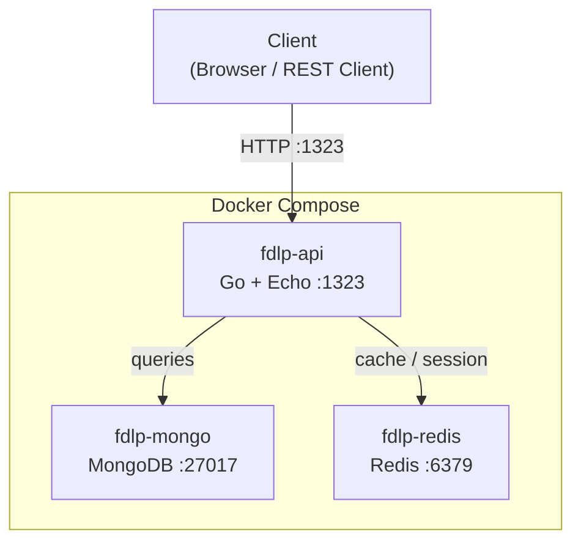
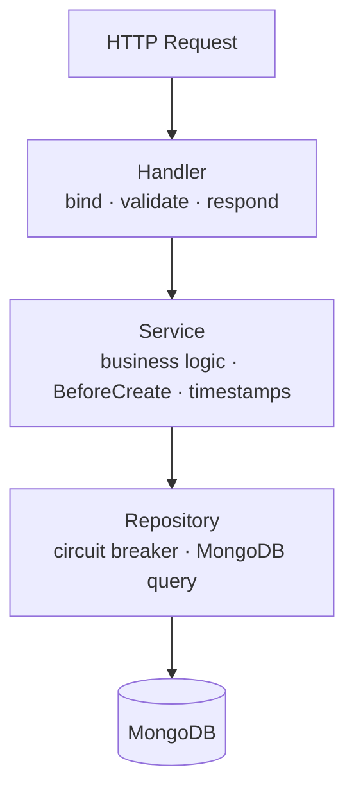
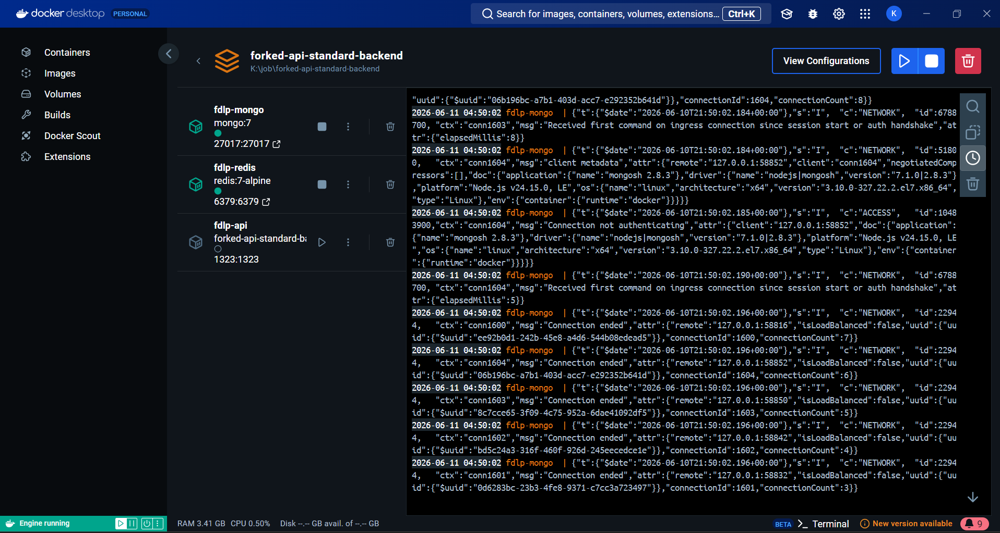

# Assignment Result

## Table of Contents

- [System Architecture](#system-architecture)
- [New Files Added](#new-files-added)
- [Files Modified](#files-modified)
- [Docker Compose](#docker-compose)
- [Running Containers on Docker Desktop](#running-containers-on-docker-desktop)
- [Test Results](#test-results)
- [API Verification](#api-verification)
- [New Feature: Post](#new-feature-post)

---

## System Architecture

### Infrastructure (Docker Compose)



### Application Layers (Clean Architecture)



---

## New Files Added

| File | Description |
|------|-------------|
| `docker-compose.yml` | Docker Compose for local development (API + MongoDB + Redis) |
| `env_files/.env.dev` | Environment variables for local development |
| `internal/echo/validator.go` | Echo custom validator wrapper using `go-playground/validator/v10` |
| `internal/tests/mock/repositories/role_repository_mock.go` | Mock role repository for unit/integration tests |
| `internal/tests/mock/services/role_service_mock.go` | Mock role service for handler unit tests |
| `internal/tests/services/role_service_test.go` | Unit tests for `RoleService` (CreateRole) |
| `internal/tests/handlers/role_handler_test.go` | Unit tests for `RoleHandler` (CreateRole, GetRole) |
| `internal/tests/integration/setup_test.go` | Integration test server setup (real Echo + real service + mock repo) |
| `internal/tests/integration/role_routes_test.go` | Integration tests for role HTTP routes |
| `internal/models/post.go` | Post model with UUID hook and timestamps |
| `internal/dto/post_data.go` | `CreatePostRequestBody` DTO with validation |
| `internal/repositories/post_repository.go` | Post repository with circuit breaker pattern |
| `internal/services/post_service.go` | Post business logic (`GetPost`, `CreatePost`) |
| `internal/handler/post_handler.go` | Post HTTP handler (`GetPost`, `CreatePost`) |
| `internal/routes/post_routes.go` | Route registration for post endpoints |
| `api-collection/post.http` | REST Client requests for post endpoints |

## Files Modified

| File | Change |
|------|--------|
| `Dockerfile.dev` | Fixed `as` → `AS`, removed non-existent `COPY` targets |
| `cmd/main.go` | Load env from `env_files/.env.dev` |
| `internal/echo/server.go` | Register validator on Echo instance |
| `internal/services/role_service.go` | Call `BeforeCreate()` and set `CreatedAt`/`UpdatedAt` timestamps |
| `go.mod` / `go.sum` | Added `github.com/go-playground/validator/v10` |

---

## Docker Compose

```yaml
services:
  api:
    build:
      context: .
      dockerfile: Dockerfile.dev
    container_name: fdlp-api
    ports:
      - "1323:1323"
    env_file:
      - env_files/.env.dev
    environment:
      - REDIS_HOST=redis
      - MONGODB_URI=mongodb://mongo:27017
    volumes:
      - .:/app
    depends_on:
      mongo:
        condition: service_healthy
      redis:
        condition: service_healthy
    restart: unless-stopped

  mongo:
    image: mongo:7
    container_name: fdlp-mongo
    ports:
      - "27017:27017"
    volumes:
      - mongo_data:/data/db
    healthcheck:
      test: ["CMD", "mongosh", "--eval", "db.adminCommand('ping')"]
      interval: 10s
      timeout: 5s
      retries: 5
    restart: unless-stopped

  redis:
    image: redis:7-alpine
    container_name: fdlp-redis
    command: redis-server --requirepass redispassword
    ports:
      - "6379:6379"
    volumes:
      - redis_data:/data
    healthcheck:
      test: ["CMD", "redis-cli", "-a", "redispassword", "ping"]
      interval: 10s
      timeout: 5s
      retries: 5
    restart: unless-stopped

volumes:
  mongo_data:
  redis_data:
```

## Running Containers on Docker Desktop



---

## Test Results

### Before handler and integration directories were created

```
PS K:\job\forked-api-standard-backend> go test -v ./internal/tests/services/... ./internal/tests/handlers/...
# ./internal/tests/handlers/...
pattern ./internal/tests/handlers/...: GetFileAttributesEx .\internal\tests\handlers\: The system cannot find the file specified.
FAIL    ./internal/tests/handlers/... [setup failed]
=== RUN   TestCreateRole_SetsRoleID
--- PASS: TestCreateRole_SetsRoleID (0.00s)
=== RUN   TestCreateRole_SetsTimestamps
--- PASS: TestCreateRole_SetsTimestamps (0.00s)
=== RUN   TestCreateRole_ReturnsErrorOnRepoFailure
--- PASS: TestCreateRole_ReturnsErrorOnRepoFailure (0.00s)
PASS
ok      fdlp-standard-api/internal/tests/services       2.266s
FAIL
```

```
PS K:\job\forked-api-standard-backend> go test -v ./internal/tests/integration/...
# ./internal/tests/integration/...
pattern ./internal/tests/integration/...: GetFileAttributesEx .\internal\tests\integration\: The system cannot find the file specified.
FAIL    ./internal/tests/integration/... [setup failed]
FAIL
```

**Cause:** `internal/tests/handlers/` and `internal/tests/integration/` directories did not exist yet. Go could not find the paths on the filesystem.

**Resolution:** Created the missing directories and test files. All three test suites (services, handlers, integration) now run successfully.

### After all test files were created

```
PS K:\job\forked-api-standard-backend> go test -v ./internal/tests/services/... ./internal/tests/handlers/...

=== RUN   TestCreateRole_SetsRoleID
--- PASS: TestCreateRole_SetsRoleID (0.00s)
=== RUN   TestCreateRole_SetsTimestamps
--- PASS: TestCreateRole_SetsTimestamps (0.00s)
=== RUN   TestCreateRole_ReturnsErrorOnRepoFailure
--- PASS: TestCreateRole_ReturnsErrorOnRepoFailure (0.00s)
PASS
ok      fdlp-standard-api/internal/tests/services       (cached)
=== RUN   TestCreateRole_Returns201OnSuccess
--- PASS: TestCreateRole_Returns201OnSuccess (0.00s)
=== RUN   TestCreateRole_Returns400WhenNameMissing
--- PASS: TestCreateRole_Returns400WhenNameMissing (0.00s)
=== RUN   TestCreateRole_Returns500OnServiceError
--- PASS: TestCreateRole_Returns500OnServiceError (0.00s)
=== RUN   TestGetRole_Returns200OnSuccess
--- PASS: TestGetRole_Returns200OnSuccess (0.00s)
=== RUN   TestGetRole_Returns404WhenNotFound
--- PASS: TestGetRole_Returns404WhenNotFound (0.00s)
PASS
ok      fdlp-standard-api/internal/tests/handlers       (cached)
```

```
PS K:\job\forked-api-standard-backend> go test -v ./internal/tests/integration/...
=== RUN   TestIntegration_CreateRole_Returns201
--- PASS: TestIntegration_CreateRole_Returns201 (0.00s)
=== RUN   TestIntegration_CreateRole_Returns400WhenNameMissing
--- PASS: TestIntegration_CreateRole_Returns400WhenNameMissing (0.00s)
=== RUN   TestIntegration_GetRole_Returns200
--- PASS: TestIntegration_GetRole_Returns200 (0.00s)
=== RUN   TestIntegration_GetRole_Returns404WhenNotFound
--- PASS: TestIntegration_GetRole_Returns404WhenNotFound (0.00s)
PASS
ok      fdlp-standard-api/internal/tests/integration    0.179s
```

---

## API Verification

Health check via REST Client (`api-collection/helpcheck.http`):

```
HTTP/1.1 200 OK
Content-Type: text/plain; charset=UTF-8
Vary: Origin
Date: Wed, 10 Jun 2026 21:42:11 GMT
Content-Length: 31
Connection: close

fdlp Standard API Status:Online
```

---

## New Feature: Post

### Overview
A new `Post` resource was added following the hexagonal architecture pattern already established by the `Role` feature. It exposes two public endpoints for creating and retrieving posts stored in MongoDB.

### Entity

| Field | Type | BSON | Notes |
|---|---|---|---|
| `post_id` | UUID | `post_id` | Auto-generated via `BeforeCreate()` |
| `title` | string | `title` | Required |
| `content` | string | `content` | Required |
| `author` | string | `author` | Required |
| `created_at` | time.Time | `created_at` | Set on create |
| `updated_at` | time.Time | `updated_at` | Set on create |

### Endpoints

| Method | Path | Description | Success | Error |
|---|---|---|---|---|
| `POST` | `/post/create-post` | Create a new post | 201 | 400 (validation), 500 (db) |
| `GET` | `/post?id=<post_id>` | Get post by ID | 200 | 404 |

### High-Level Workflow

```
HTTP Request
     │
     ▼
PostHandler          ← bind + validate input (400 if invalid)
     │
     ▼
PostService          ← calls BeforeCreate() to generate UUID,
     │                 sets CreatedAt/UpdatedAt, delegates to repo
     ▼
PostRepository       ← executes MongoDB query inside circuit breaker
     │                 collection: "posts"
     ▼
MongoDB (posts)
```

**CreatePost flow:**
1. Client sends `POST /post/create-post` with `{ title, content, author }`
2. Handler binds JSON and validates required fields
3. Service generates `post_id` (UUID), sets timestamps, calls `repo.Create`
4. Repository inserts document into `posts` collection via circuit breaker
5. Handler returns `201` with the created post object

**GetPost flow:**
1. Client sends `GET /post?id=<uuid>`
2. Handler reads `id` query param, calls `service.GetPost`
3. Service delegates to `repo.GetById`
4. Repository queries `{ post_id: id }` in `posts` collection
5. Handler returns `200` with post data, or `404` if not found

### Files

| Layer | File |
|---|---|
| Model | `internal/models/post.go` |
| DTO | `internal/dto/post_data.go` |
| Repository | `internal/repositories/post_repository.go` |
| Service | `internal/services/post_service.go` |
| Handler | `internal/handler/post_handler.go` |
| Routes | `internal/routes/post_routes.go` |
| Wired in | `internal/echo/server.go` |
| Docs | `docs/swagger.yaml` |
| API collection | `api-collection/post.http` |
